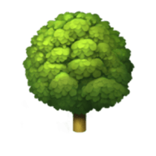
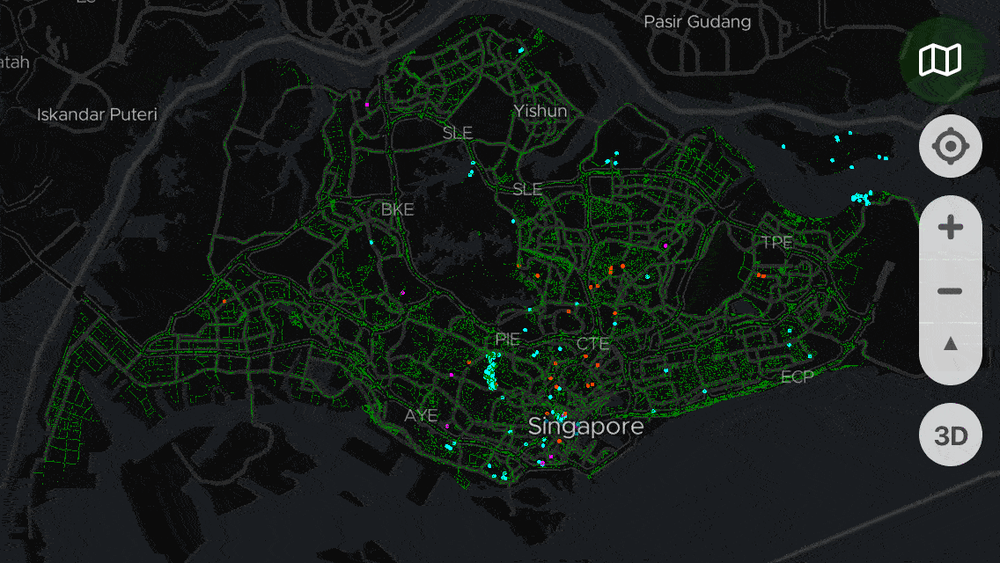
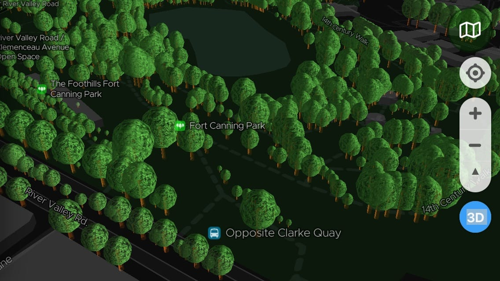

  

  # ExploreTrees.SG

**Explore Trees in Singapore** 🌳🌲🌴

On [17 March 2018](https://twitter.com/nparksbuzz/status/974857306734120960), [National Parks Board](https://www.nparks.gov.sg/) launched an all-new web site called [Trees.sg](http://trees.sg). On the next day, I started [my journey in getting the data](https://twitter.com/cheeaun/status/975272277926330369) [and visualizing it to my heart's content](https://twitter.com/cheeaun/status/976657582105362432).

This is a personal side project to fuel my curiosity on these factors:

- Plotting more than 500,000 data points on [Mapbox GL JS](https://www.mapbox.com/mapbox-gl-js/).
- Data visualization of all tree data, in 4 criterias:
  - **Type**; Tree, Heritage
  - **Girth** (meters)
  - **Age** (years)
  - **Family** (to group up the large number of species)
- Discovery of trees.
  - Prominent/important trees stand out more by having larger radii.
  - Super fast info card by just hovering on the tree markers (for devices with a mouse).

## 👇👇👇 Read more about it 👇👇👇

- 2018: [Building ExploreTrees.SG](https://cheeaun.com/blog/2018/04/building-exploretrees-sg/)
- 2019: [Next-level visualizations with ExploreTrees.SG](https://cheeaun.com/blog/2019/07/next-level-visualizations-exploretrees-sg/)

## Technicalities

### Web App

[Node.js](https://nodejs.org/) is required.

- `npm install` - install dependencies.
- `npm start` - start a local server for the site.
- `npm run build` - build the assets in `dist` folder for deployment.

### Data

Available here: [cheeaun/sgtreesdata](https://github.com/cheeaun/sgtreesdata).

### Icon

Uses 🌳. Generated via <https://formito.com/tools/favicon> (Size `80`).

## Copyright & license

- Data from [Trees.sg](http://trees.sg) © [National Parks Board](http://www.nparks.gov.sg/)
- Map © [Mapbox](https://www.mapbox.com/about/maps/) © [OpenStreetMap contributors](https://www.openstreetmap.org/copyright)
- SVG icons from [Font Awesome](https://fontawesome.com/license)
- Code licensed under [MIT](https://cheeaun.mit-license.org/)

## Similar visualizations/effort

- [New York City Street Trees by Species](http://jillhubley.com/blog/nyctrees)
- [Treepedia: Singapore](http://senseable.mit.edu/treepedia/cities/singapore)
- [An Interactive Visualization of NYC Street Trees](https://www.cloudred.com/labprojects/nyctrees/)
- [New York City Street Trees](https://belindakanpetch.shinyapps.io/StreetTrees/)
- [Atlanta's Tree Canopy Data Visualization](http://www.beckyscheel.com/atl-tree-dataviz/)
- [Trees of Madison](http://acouch.github.io/madison-trees/)
- [Melbourne Urban Forest Visual](http://melbourneurbanforestvisual.com.au/)
- [OpenTrees.org](http://www.opentrees.org/)
- [San Francisco Urban Forest Map](https://urbanforestmap.org/)
- [OpenTreeMap](https://www.opentreemap.org/)
