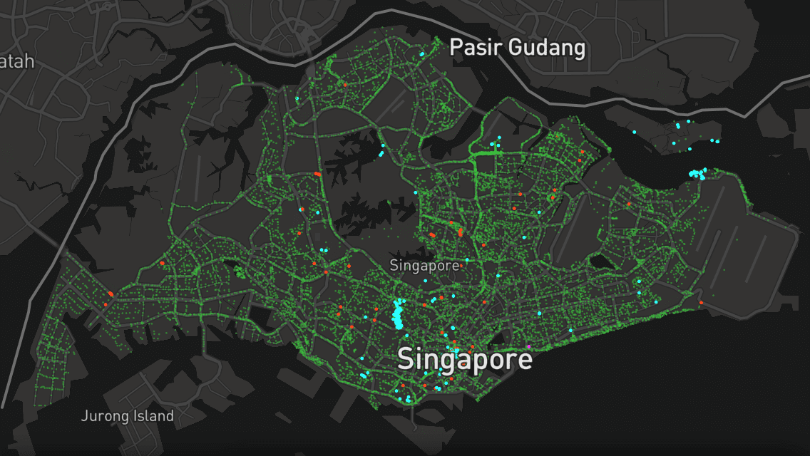
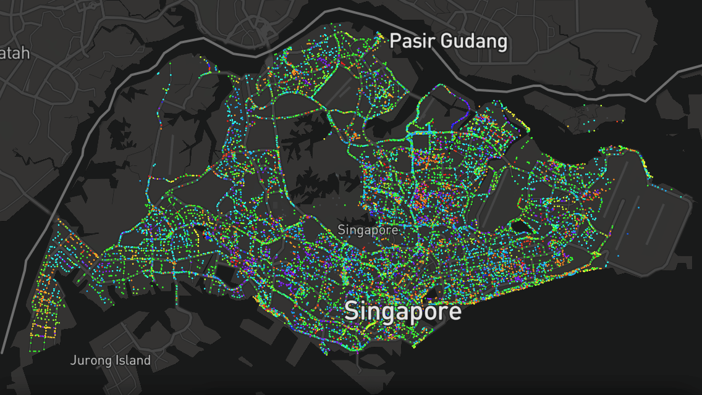

Explore Trees in Singapore
===

On [17 March 2018](https://twitter.com/nparksbuzz/status/974857306734120960), [National Parks Board](https://www.nparks.gov.sg/) launched an all-new web site called [Trees.sg](http://trees.sg). On the next day, I started [my journey in getting the data](https://twitter.com/cheeaun/status/975272277926330369) [and visualizing it to my heart's content](https://twitter.com/cheeaun/status/976657582105362432).

This is a personal side project to fuel my curiosity on these factors:

- Plotting more than 500,000 data points on [Mapbox GL JS](https://www.mapbox.com/mapbox-gl-js/). End up using [Tippecanoe](https://github.com/mapbox/tippecanoe) to convert `GeoJSON` files into `MBTiles`.
- Data visualization of all tree data, in 4 criterias:
  - **Type**; Tree, Flowering, Heritage
  - **Girth** (meters)
  - **Age** (years)
  - **Family** (to group up the large number of species)
- Discovery of trees.
  - Prominent/important trees stand out more by having larger radii.
  - Super fast info card by just hovering on the tree markers (for devices with a mouse).

Technicalities
---

All scripts for fetching and cleaning up data are in the `scripts` folder. [Node.js](https://nodejs.org/en/) and [`npm`](https://www.npmjs.com/) are required to run them.

Begin by installing all the essential dependencies.

> npm install

Scripts provided (should be executed in order):

- `npm run trees` - fetch all raw tree data from [Trees.SG](http://trees.sg) (NOT included in this repository) and generate `grid-*.json` files in the `data` folder.
- `npm run chunk` - read all the raw data and generate a cleaner `trees-everything.geojson`.
- `npm run family` - fetch family categories for the trees.
- `npm run pre-tiles` - generate the needed `GeoJSON` files before converting to `MBTiles`.
- `npm run tiles` - generate the ultimate final `trees.mbtiles` file, to be uploaded on Mapbox.
- `npm start` - start a local server for the site.

Copyright & license
---

- Data from [Trees.sg](http://trees.sg) © [National Parks Board](http://www.nparks.gov.sg/)
- Map © [Mapbox](https://www.mapbox.com/about/maps/) © [OpenStreetMap](http://www.openstreetmap.org/about/)
- SVG icons from [Font Awesome](https://fontawesome.com/license)
- Code licensed under [MIT](https://cheeaun.mit-license.org/)

Similar visualizations
---

- [New York City Street Trees by Species](http://jillhubley.com/blog/nyctrees)
- [Treepedia: Singapore](http://senseable.mit.edu/treepedia/cities/singapore)
- [An Interactive Visualization of NYC Street Trees](https://www.cloudred.com/labprojects/nyctrees/)
- [New York City Street Trees](https://belindakanpetch.shinyapps.io/StreetTrees/)
- [Atlanta's Tree Canopy Data Visualization](http://www.beckyscheel.com/atl-tree-dataviz/)
